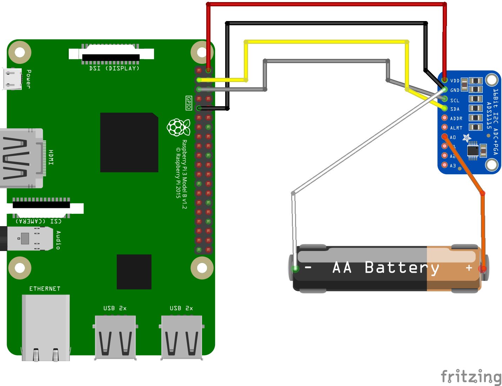

# Connection ads1115 to Raspberry pi 3

### How to start
1 Connect your ADS1115 to Raspberry pi as on the image below.

<br>

2 Clone the repo on your Raspberry 

``` git clone https://github.com/MichaelKostin/ads1115-raspberrypi.git ```

3 Go inside the project folder 

``` cd ads1115-raspberrypi ```

4 Install packages 

``` npm install ```

5 Run the code 

``` sudo node ads1115.js ```


More information about ADS115 you can find on [Datasheet](http://www.ti.com/lit/ds/symlink/ads1115.pdf)
